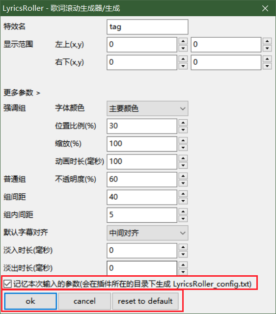
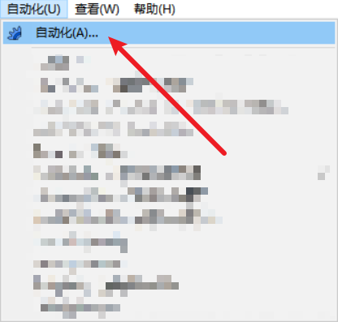
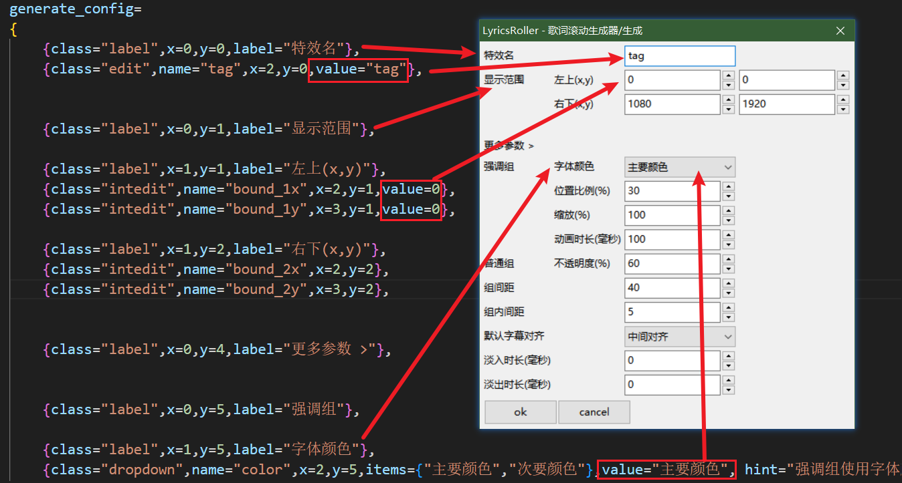

# LyricsRoller

+ 功能：为已经打好轴的歌词字幕自动生成类似 Apple Music / 网易云音乐 的滚动歌词

    ✔ 支持**卡拉OK**效果（需要将参数**字体颜色**设置为**主要颜色**）

    ✔ 支持非英文字符的**自动换行**（但是会把单个英文单词分割到两行中）

    ✔ 支持自定义歌词的**对齐**方式（详见[更多用法](#更多用法)）

+ 效果对比

    | 原歌词                                              | 现歌词                                             |
    | --------------------------------------------------- | -------------------------------------------------- |
    |  |  |

+ 视频效果演示

    （可见示例文件 `二度寝_lyrics_roller.mp4`）
    
    https://github.com/user-attachments/assets/d689d208-b66d-488e-a678-5682f5c63efe
    
+ **示例**位于 `/example` 文件夹下，其包含以下文件：

    + 二度寝.ass（已生成滚动歌词的字幕文件，可自行复原）
    + 二度寝.mp4（字幕用到的视频文件）
    + 二度寝_lyrics_roller.mp4（使用上述两个文件压制成的最终视频文件）
    + 二度寝-karaok.ass（卡拉OK示例的字幕文件）
    + 二度寝-karaok_lyrics_roller.mp4（卡拉OK字幕文件生成的最终视频文件）

❗ 所有图片和视频演示均为v1.0版本，新增功能请在[更新历史](#更新历史)查看

## 目录

- [LyricsRoller](#lyricsroller)
  - [更新历史](#更新历史)
  - [目录](#目录)
  - [使用方法](#使用方法)
    - [载入插件](#载入插件)
    - [基本使用方式](#基本使用方式)
    - [你需要注意的](#你需要注意的)
  - [名词解释](#名词解释)
  - [参数解释](#参数解释)
  - [更多用法](#更多用法)
    - [卡拉OK效果](#卡拉ok效果)
    - [单独指定对齐方式](#单独指定对齐方式)
    - [修改插件对话框中的默认值](#修改插件对话框中的默认值)

## 更新历史

+ v1.1
    + 新增**保存输入参数**的功能
        + 在对话框中勾选 **记忆本次输入的参数** 即可
        + 点击 **reset to default **可恢复最初的默认参数
        
    + 现在可以通过**Enter键**和**Esc键**快捷选择对话框按钮的**ok**和**cancel**了
    
        
    
+ v1.0

## 使用方法

### 载入插件

1. 在**Release**列表中下载最新的文件 `LyricsRoller.lua`

2. 在**Aegisub**中载入插件
    + 方法一（**推荐**）：打开Aegisub的本地文件夹目录，进入子目录`Aegisub/automation/autoload`，将下载的文件 `LyricsRoller.lua` 放入此文件夹中
    
        

            
图片示例

             
            
比如我安装的Aegisub是在D盘的tool文件夹下，那么我应该将插件放在图示位置中：

            
        

        
    + 方法二：（菜单）自动化 → 自动化 → 载入 → 选择`LyricsRoller.lua`
    
        

            
图片演示

             
            
              
            
        

### 基本使用方式

1. 在**标准模式**找出想要显示滚动歌词的矩形范围的**左上角**和**右下角**的点的坐标

    

    2. 将所有需要用于滚动歌词的**行**设置一个**相同的特效名**

        

        ❗ 建议在**第一句歌词前**增加一个从音乐开始时间到第一句歌词开始时间的**空行**（如上图的第四行）、并在最后一句歌词后增加一歌**空行**持续到**音乐结尾**，从而让歌词显示效果更加完整（目的：延长插件所生成的歌词的显示时间至整首歌的时长）

    3. （菜单）自动化 → LyricsRoller - 歌词滚动生成器 → 生成

        

4. 在**特效名**中填写你在**2**中设置的特效名、在**显示范围**中填写你在**1**记录的矩阵范围的坐标点，并根据自己的需要设置**更多参数**

    

    ❗ **更多参数**的解释及效果见[参数解释](#参数解释)部分

5. 点击**ok**，会生成滚动歌词，并自动覆盖之前使用相同特效名所生成的滚动歌词，生成结果可见[一开始的对比图](#lyricsroller)

6. 若要手动删除所有使用此特效名生成的滚动歌词，点击（菜单）自动化 → LyricsRoller - 歌词滚动生成器 → 复原，输入使用的特效名，并点击**ok**

    

    

### 你需要注意的

+ LyricsRoller会自动将具有**相同开始时间**的字幕行视作**同一组**，因此请为需要在同一时间内显示的歌词（如原文+译文+注释）设置相同的开始时间

+ 对于**同一组**的字幕行，LyricsRoller会按照原来的字幕顺序将其放在一起

    + 例如，如果你想在最终的滚动歌词中，让译文显示在原文上方，那么你应该在使用插件前将译文对应的行放在原文的行的上方

    + 一个简单的方法是按照**样式名**将所有行进行**排序**，并把所有译文样式的行剪切放在原文样式的行的上方

    + | 译文在原文上方                                               | 译文在原文下方                                               |
        | ------------------------------------------------------------ | ------------------------------------------------------------ |
        |  生成结果  |  生成结果  |

+ 请在使用LyricsRoller前，尽量确保字幕已经正常打好了轴，否则你应当清楚LyricsRoller对不同开始时间、结束时间的统一方式：

    + LyricsRoller会自动统一**同一组**字幕的**结束时间**，此时间来自于此组的字幕里**最晚的结束时间**
    + 若某组的结束时间晚于**下一组的开始时间**，则修改此结束时间为下一组的开始时间
    + 若两个**组**之间的间隔时间小于**强调组的动画时长**（见[参数解释](#参数解释)），则会将上一组的结束时间修改为下一组的开始时间

+ 请尽量不要在行中手动修改**字体大小**或进行其他有可能影响到字体大小的操作（比如修改字体），因为**自动换行**功能会**忽略**行内的所有**特效**

+ 请尽量不要在行中使用换行符 `\n` 或 `\N` 或手动空格等字符，因为**自动换行**功能不会解析这些代码，且会视为一个个**独立的字符**，从而导致自动换行可能出现错误

+ LyricsRoller理论上**不支持**Aegisub的**注音**（furi）功能，因为其生成的注音的位置是固定的，但LyricsRoller在生成滚动字幕时不会去计算同一组内不同行字幕之间的相对位置

    + 本人目前没有注音滚动字幕的需求，因此暂不考虑增加此功能，不过也欢迎各位进行改进

## 名词解释

+ 组：所有开始时间相同的字幕行的集合
+ 强调组：当前的音频时间处于某一组的开始时间与结束时间之内，则此组称为强调组
    + 对应音乐歌词中当前唱到的那一句
+ 普通组：强调组以外的其他组

## 参数解释

| 参数名       | 参数名   | 数据类型 | 数据范围                   | 作用                                                         |
| ------------ | -------- | -------- | -------------------------- | ------------------------------------------------------------ |
| 特效名       |          | 字符串   | -                          | 指定用于生成的字幕行                                         |
| 显示范围     | (x,y)    | 整数     | -                          | 指定生成歌词的显示范围                                       |
| 强调组       | 字体颜色 | -        | 主要颜色 / 次要颜色        | 指定**强调组**中字幕行的字体颜色为其对应样式中的**主要颜色**还是**次要颜色** 卡拉OK模式下需要选择**主要颜色** |
|              | 位置比例 | 整数     | 0 - 100                    | 指定**强调行**在显示范围内的位置 此数值表示强调组顶部的y轴位置在整个显示范围内的比例（最上面是0，最下面是1） |
|              | 缩放     | 整数     | 0 ~                        | 指定**强调行**相对普通行的字体大小的比例 100即为相同大小 ❗ 若要使此特效有效，需要用到插件**VSFilterMod**，使用方式和用于压制的方式请自行搜索 |
|              | 动画时长 | 整数     | 0 ~                        | 指定普通行变为强调行、强调行变为普通行时的动画的时长(毫秒) 动画包括：颜色变化、位置移动、缩放 动画所占用的时间均为强调行的时间 |
| 普通组       | 不透明度 | 整数     | 0 - 100                    | 指定**普通行**字体的透明度 100即为完全不透明 与之对应的，强调行的不透明度为100% |
| 组内间距     |          | 整数     | 0 ~                        | 组内不同字幕行之间的距离                                     |
| 组间距       |          | 整数     | 0 ~                        | 两组之间的距离                                               |
| 默认字幕对齐 |          | -        | 左对齐 / 中间对齐 / 右对齐 | 字幕在整个显示范围中的x轴对齐方式，单独指定方式见[更多用法](#更多用法) |
| 淡入时长     |          | 整数     | 0 ~                        | 最早的开始时间时，淡入显示整个滚动歌词的时长(毫秒)           |
| 淡出时长     |          | 整数     | 0 ~                        | 最晚的结束时间时，淡出显示整个滚动歌词的时长(毫秒)           |

## 更多用法

### 卡拉OK效果

+ 使用方式：正常在字幕行中加入 `\K` 等标签，并指定强调行的颜色为**主要颜色**即可

+ 视频效果演示（仅日语歌词有卡拉OK效果）
  
  （可见示例文件 `二度寝-karaok_lyrics_roller.mp4`）
  
  https://github.com/user-attachments/assets/f505a33b-e40a-4a3c-b40a-1469cb47560e

### 单独指定对齐方式

+ 为某一行的特效名增加后缀 `-l` / `-L` / `-c` / `-C` / `-r` / `-R`，可指定此行的对齐方式，分别为左对齐、中间对齐、右对齐

+ 当不指定时，会使用默认的字幕对齐方式

+ 示例：
  
    1. 指定特效名
    
        
    
    2. 默认中间对齐
    
         
    
    3. 生成效果
    
        
    

### 修改插件对话框中的默认值

+ 打开源文件`LyricsRoller.lua`，修改数组**generate_config**里对应属性的**value**即可

    ❗ 显示范围的 **右下(x,y)** 无法通过此方式修改，因为其会自动获取视频的尺寸并设置为右下角的位置

+ 示例：参数名以及值的对应

    
